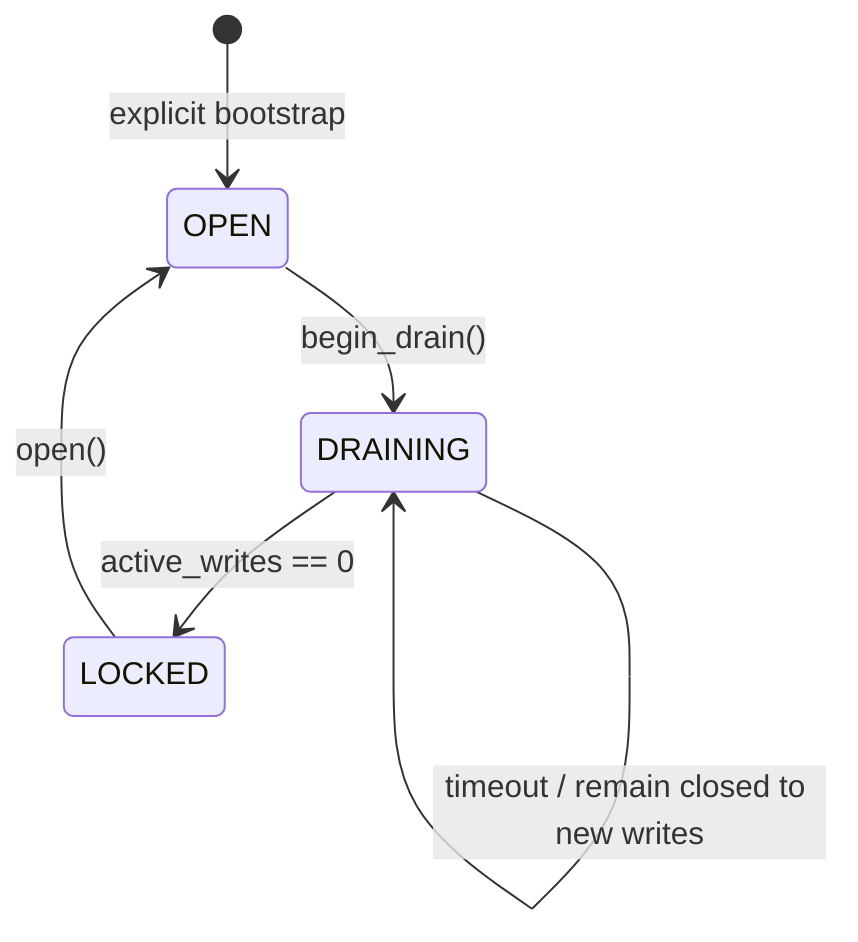

# AYLA LIFE — Economy Write Gate (M1C)

## Scope

M1C adds coordination only. The legacy `EconomyService` and
`economy_profiles.balance` remain authoritative. The Ayla Life Economic
Kernel is not used by legacy commands, Genesis is not invoked, and no real
cutover is performed.

## Guarantees

`EconomyWriteGate` admits a new write only while `OPEN`. Admission and state
transition use the same condition lock, so a writer cannot pass an OPEN check
and increment after `DRAINING` has won the race. Every admitted operation owns
a lease released in `finally`, including exceptions and async cancellation.
Nested calls in the same execution context are reentrant and do not double
count `active_writes`.

`drain_and_lock(timeout)` changes state to `DRAINING`, rejects new writers,
waits for existing leases, and enters `LOCKED` only at zero active writes. A
timeout returns diagnostics and leaves the gate in `DRAINING`; it never forces
the lock.

## Persistence and startup

State is stored outside `economy_profiles`, at
`ECONOMY_WRITE_GATE_STATE_PATH` (default `data/economy_write_gate.json`). The
file contains version, state, entered timestamp, reason, and a bounded durable
transition event history. Writes use a sibling temporary file and atomic
replace; permissions are restricted to `0600` where supported.

The application wiring performs the explicit `bootstrap_open()` first-install
bootstrap to OPEN. Bootstrap creates the state file and an adjacent persistent
`.initialized` marker. Subsequent bootstrap calls only load and preserve the
existing state; they never force OPEN. If the state file is later missing while
the marker remains, bootstrap fails closed instead of treating the machine as a
first install. Constructing a gate directly without `bootstrap_open()` also
fails closed if the file is missing. Invalid JSON, unknown state, malformed
events, or a rejected symlink fail closed. Existing `DRAINING` and `LOCKED`
states survive a process restart and are not automatically reopened. Graceful
shutdown does not change state.

This implementation assumes one production economic writer process. The file
is not a distributed lock and active leases are process-local. Multi-process
writers require a shared database/coordination service before deployment.

## Mutation inventory and boundary

The complete source audit found the following direct legacy balance mutation
families:

| Path | Canonical boundary | Gate status |
|---|---|---|
| `/daily` direct claim | `EconomyService.claim_daily` | gated |
| `/api/daily-ayla` | `EconomyService.claim_daily` | gated, returns HTTP 503 |
| `/pagar` | `EconomyService.transfer` | gated |
| `/addmoney` | `EconomyService.add_balance` | gated |
| coinflip, dado, slots, roleta, highlow, 21, cartaalta | `EconomyService.add_balance` | gated |
| challenge wager settlement | `EconomyService.add_balance` | gated |
| persistent Bingo join | `BingoService.join` | gated |
| persistent Bingo leave/cancel refund | `BingoService.leave/cancel` | gated |
| persistent Bingo prize | `BingoService.claim` | gated |
| profile creation via `_ensure_profile` | `EconomyService.get_profile` write branch | gated |

The current Discord Bingo command uses an in-memory game object and does not
mutate money; the persistent `BingoService` paths are nevertheless gated.
Reads of existing profiles remain available. A read of an unknown profile may
need to create a zero row, so that specific implicit mutation is admitted
through the gate and is rejected while closed.

The common service boundary is intentional: future Discord, API, worker, and
engine callers must use the same service/kernel mutation boundary rather than
adding command-local flags.

## Multi-step games and in-flight work

The current legacy games settle money only at the `add_balance`/transfer call;
they do not hold a lease for the full interaction lifetime. Therefore a game
started while OPEN may continue its UI, but a settlement that has not entered
the service before `DRAINING` is rejected. Operators must drain/cancel or
resolve those sessions before opening the new system. This is conservative:
no payout or loss can begin after `LOCKED`.

Persistent Bingo uses the same rule for join, refund and prize. Non-economic
draw/mark/UI state can remain available, but its economic action is refused
once the gate is draining or locked.

## Operational control and audit

`begin_drain`, `lock`, and `open` are service-level control methods and are not
exposed as ordinary Discord commands. A future controller must authenticate
the operator and supply a bounded reason. Every bootstrap and transition is
persisted with timestamp, previous/new state, actor, and sanitized reason.
The snapshot API exposes state, active lease count, entered time, reason, and
event count for internal diagnostics.

## Cutover use

The future operator sequence is:

1. `OPEN -> DRAINING` with an authenticated reason.
2. wait for `active_writes == 0`; abort and investigate on timeout.
3. `DRAINING -> LOCKED`.
4. take the consistent legacy snapshot and run Genesis in a separate target.
5. verify/reconcile while still LOCKED.
6. only after an approved authority switch, open the future path.

M1C does not implement or activate that switch. Reads remain available during
the gate unless a later cutover stage chooses otherwise.

## Security limitations

The state path is configuration, not caller input. The current implementation
rejects a pre-existing symlink and sanitizes log reasons, but does not provide
OS-level distributed locking or staff authentication. The deployment must
ensure the parent directory and state file are owned by the bot user.
