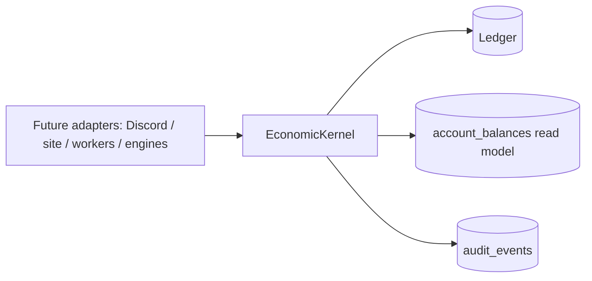
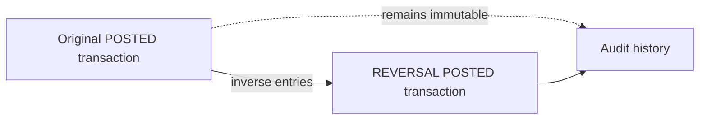
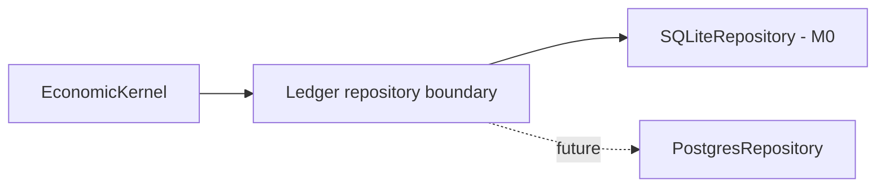

# Ayla Life M0 — Economic Kernel

Status: `AYLA_LIFE_M0_READY` for review after M0.1 hardening.

## 1. Scope and isolation

M0 introduces a standalone double-entry financial kernel. It does not import
the legacy economy and does not modify `economy_profiles`, the existing
Discord commands, site API, Bingo, XP, or any production flow.

The package lives in `ayla_life/economy` because it is a domain boundary rather
than a Discord service:



Money is represented as integer minor units. No float or exchange conversion
is used. A currency's `decimal_places` is metadata for future presentation;
the kernel still receives integer units.

## 2. Persistence schema

`repository.py` owns SQLite setup and connection policy. The kernel uses a
separate database path supplied by the caller.

### `currencies`

Stores `id`, `name`, unique `code`, `emoji`, `decimal_places`, `status`,
`created_at`, `retired_at`, and JSON `metadata`. Status values are `ACTIVE`,
`RETIRED`, `PARALLEL`, and `FAILED`.

### `accounts`

Stores stable `id`, `account_type`, optional `owner_type`/`owner_id`, `status`,
JSON `metadata`, and timestamps. Account types include `PLAYER`,
`CENTRAL_BANK`, `TREASURY`, `HOUSE`, `ESCROW`, `NPC`, `BUSINESS`, and
`SYSTEM`. Multiple accounts per owner are allowed because no owner uniqueness
constraint is imposed.

### `ledger_transactions`

Stores transaction identity, type, status, actor, reference, unique
`idempotency_key`, canonical `payload_hash`, description, metadata, timestamps,
and optional `reversal_of`. Types are `TRANSFER`, `MONETARY_ISSUANCE`,
`MONETARY_BURN`, `ADMIN_ADJUSTMENT`, `GENESIS`, and `REVERSAL`.

### `ledger_entries`

Stores `transaction_id`, `account_id`, `currency_id`, signed integer `amount`,
and `created_at`. Each posted transaction must sum to zero independently for
each currency.

### `account_balances`

Read model keyed by `(account_id, currency_id)`, with `balance`, `version`, and
`updated_at`. It is updated in the same database transaction as entries and is
rebuildable by summing posted entries.

### `audit_events`

Stores event type, actor, target, transaction ID, metadata, and timestamp.
Every financial operation posted by M0 emits an event containing the
transaction ID and idempotency key.

Indexes cover account/currency entries, transaction lookup/type, audit target,
and audit transaction lookup. Foreign keys and enum-like `CHECK` constraints
are enforced by SQLite.

## 3. Accounting rules

Transfers use two signed entries:

```text
PLAYER:A  -500
PLAYER:B  +500
```

Issuance and burn use technical `SYSTEM` accounts. Their balances are not
ordinary wallets:

```text
SYSTEM:issuance:TWK  -1500
PLAYER:A              +1500

PLAYER:A              -500
SYSTEM:burn:TWK       +500
```

`GENESIS` has its own technical account and transaction type, so legacy-state
establishment is distinguishable from post-genesis issuance. M0 does not
import legacy winks.

Issuance, burn, and genesis require an active `CENTRAL_BANK` authority account.
Normal accounts cannot go negative. `SYSTEM` accounts are exempt from the
normal-wallet non-negative rule.

## 4. Idempotency and atomicity

The idempotency key and canonical payload hash are persisted in
`ledger_transactions`. Repeating a key with the same payload returns the
original transaction. Reusing it with a different payload is rejected.

Posting uses `BEGIN IMMEDIATE`, validates all entries and balances, inserts the
transaction and entries, updates `account_balances`, creates the audit event,
and commits. Any failure rolls back the complete operation. SQLite WAL and a
busy timeout are enabled for local concurrency.

Posted transactions and their entries are protected by SQLite triggers. M0
does not delete or silently edit financial history.

## 5. Frozen accounts

`FROZEN` accounts may receive funds but cannot originate negative entries.
`CLOSED` accounts cannot participate. Technical/system accounts follow their
technical role and are not ordinary player wallets.

## 6. Reversal

`reverse()` creates a new posted `REVERSAL` transaction with the exact inverse
entries and `reversal_of` pointing to the original. The original remains
immutable and posted. A unique constraint prevents a second reversal of the
same transaction, and reversal-of-reversal is rejected.



## 7. Money supply

`money_supply(currency_id)` reports:

- `issued`: positive non-system entries from `MONETARY_ISSUANCE`;
- `burned`: positive non-system source amount from `MONETARY_BURN`;
- `genesis`: positive non-system entries from `GENESIS`;
- `net_supply_created = issued - burned`;
- `total_supply = genesis + issued - burned`.

Genesis is intentionally reported separately. These values are not the sum
of all account balances because technical accounting accounts exist.

## 8. Reconciliation

`reconcile()` independently calculates posted-ledger balances and compares
them with `account_balances`. It returns checked account/currency counts,
matches, and explicit differences. M0 detects but does not automatically
repair divergence.

## 9. Invariants

Application layer guarantees:

- positive transfer/issuance/burn/genesis amounts;
- source/destination distinction;
- one currency per transfer;
- balanced entries per currency;
- authority validation;
- normal-account non-negative balances;
- frozen-account send restriction;
- persistent idempotency payload matching;
- one compensating reversal.

Database layer guarantees:

- primary and foreign keys;
- unique currency code;
- unique transaction id and idempotency key;
- unique reversal target;
- enum/status checks;
- nonzero entries;
- posted-history immutability triggers;
- atomic read-model and ledger update through the posting transaction.

## 10. PostgreSQL migration readiness

The domain does not depend on Discord and keeps SQL in `repository.py`, making
the persistence boundary replaceable. SQLite-specific pieces that must be
revisited for PostgreSQL are:

- `PRAGMA` setup and WAL configuration;
- `BEGIN IMMEDIATE` locking semantics;
- SQLite trigger syntax;
- `INSERT ... ON CONFLICT` syntax details and placeholder conventions;
- SQLite integer/autoincrement behavior for audit/entry IDs.

The domain must retain the same invariants on PostgreSQL, preferably with
stronger database constraints and `SELECT ... FOR UPDATE` or serializable
transaction strategy. No PostgreSQL migration is part of M0.

## 11. Tests and limitations

`tests/test_ayla_life_economy_kernel.py` covers currency/account rules,
balanced transfers, validation, rollback, persistent idempotency, issuance,
burn, genesis, supply, frozen accounts, reversal, reconciliation divergence,
concurrent double-spend, and concurrent idempotency.

M0 deliberately does not provide authentication, Discord adapters, legacy
bridge, automatic reconciliation repair, multi-step workflows, exchange
rates, monetary policy, inflation, or any Ayla Life gameplay system.

The final execution report records existing tests, M0 tests, concurrency,
local load, and any unrelated baseline failures.

## 12. M1 direction

`M1 — LEGACY BRIDGE` should define a controlled, reviewable `GENESIS` import
process, reconciliation against legacy balances, provenance for every
imported amount, and a read/write cutover plan. It must not silently map
`economy_profiles.balance` into the new ledger.

## 13. M0.1 hardening

The M0 review found and corrected these kernel issues:

- technical issuance/burn/genesis accounts were previously created outside
  the posting transaction; they are now created inside the same atomic unit;
- a posted transaction trigger could previously be bypassed by changing its
  status to `REVERSED`; posted transactions are now immutable, and reversal
  exists only as a compensating transaction;
- retired currencies were not explicitly rejected for new transactions;
- ordinary transfers could target a `SYSTEM` account; technical accounts now
  only participate in explicit issuance, burn, genesis, or reversal flows;
- amount, idempotency-key, account-owner, enum, and JSON metadata validation
  is now strict;
- money-supply calculations now include compensating reversals of issuance,
  burn, and genesis;
- authority validation occurs after the idempotency replay check, so a valid
  retry still returns the original result if the authority later freezes;
- concurrent reversal attempts are serialized and at most one reversal can be
  posted.

### Database lifecycle and performance

The original M0 opened a new SQLite connection for every operation and
reapplied connection PRAGMAs. Schema initialization itself happened only at
kernel construction, but connection churn and per-operation setup were the
dominant avoidable costs.

M0.1 adds `SQLiteRepository`, which owns one connection for the lifetime of an
`EconomicKernel`, applies foreign keys/WAL/busy timeout once, and serializes
same-process access with an `RLock`. Financial operations still use
`BEGIN IMMEDIATE`, commit, and rollback explicitly. `EconomicKernel.close()`
and context-manager support make shutdown deterministic; tests close kernels
before deleting temporary databases.

No durability PRAGMA was weakened. WAL and SQLite's default synchronous
behavior are retained.

Simple profile on the local Windows/Python 3.14 environment:

```text
connection + schema initialization: 0.054615 s
one posted operation:              0.004589 s
100 posted operations:             0.419257 s (4.193 ms average)
reconciliation:                    0.000311 s
```

Equivalent load runs, including setup and 100 initial issuance operations:

```text
                    Before M0.1             After M0.1
1,000 transfers      28.445 s (~35.2/s)     4.788 s (~208.9/s)
10,000 transfers     >150 s, interrupted    48.241 s (~207.3/s)
```

Both after-runs reconciled with zero differences. The before 10,000 result is
reported as a lower bound because the earlier run was interrupted after about
2.5 minutes.

### Tests

The M0.1 suite contains 23 kernel tests. It adds deterministic randomized and
reference-model checks, reversal/authority edge cases, direct SQLite attack
checks, restart checks, and failure injection after transaction insert, ledger
entry, balance update, before audit, and before commit. All failure points
reopen cleanly with no partial transaction and a successful reconciliation.

The full Ayla suite is green:

```text
245 tests passed
```

The former global error was caused by an existing test leaving SQLite handles
open during Windows temporary-directory cleanup. The correction only changes
that test's connection lifecycle; functional migration behavior is unchanged.

Technical-account policy is explicit: `SYSTEM` accounts may become negative
as accounting counterparts, are excluded from ordinary economic money-supply
totals, and cannot be used by `TRANSFER` or `ADMIN_ADJUSTMENT`. They are
created only within the issuance, burn, genesis, or reversal transaction that
needs them. Normal accounts remain non-negative; frozen accounts may receive
but cannot originate funds.

### Remaining limitations

- SQLite remains the only implementation; PostgreSQL is not introduced.
- Same-process kernel access is serialized; multi-process deployment still
  requires a single-writer/locking deployment decision.
- `ADMIN_ADJUSTMENT` is represented as a transaction type but has no public
  posting primitive in M0.
- Failure injection is an internal test hook and is not exposed to adapters.
- Reconciliation detects divergence but does not repair it automatically.
- No legacy bridge or real balance import exists.

The repository/domain boundary remains ready for a future repository adapter:



SQLite-specific migration work for PostgreSQL will include replacing PRAGMAs,
`BEGIN IMMEDIATE`, SQLite trigger syntax, and `INSERT ... ON CONFLICT` details
with PostgreSQL locking/trigger/constraint equivalents. The domain invariants
must remain unchanged.
