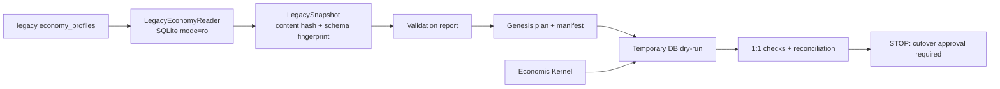
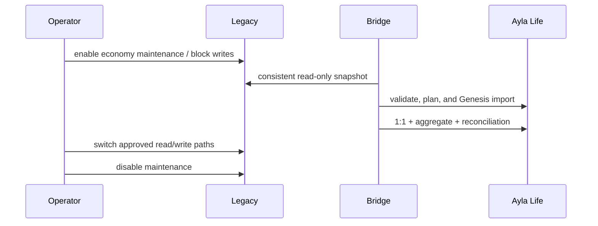

# AYLA LIFE M1 — Legacy Bridge & Genesis Preparation

## Status and scope

This phase is preparation only. The bridge reads a legacy SQLite database in
URI `mode=ro`, creates an immutable snapshot identity, validates it, produces
a Genesis plan, and runs that plan only against a temporary Ayla Life
database. There is no cutover executor, no legacy command integration, and no
import of real balances.

If a production read-only database path and authorization are not supplied,
the operational status is `REQUIRES_PRODUCTION_DB_READ_ONLY_INSPECTION`.
The tests use synthetic temporary databases only.



## Architecture

`ayla_life/legacy_bridge` is an adapter layer. It may call the independent
Economic Kernel for a local dry-run, but the kernel does not import or know
about `economy_profiles`. Discord commands, site API, `/saldo`, `/pagar`,
`/daily`, and all other legacy flows remain unchanged.

Files:

- `reader.py`: read-only source access, schema fingerprint, snapshot hash, and validation.
- `models.py`: immutable snapshot, profile, issue, and validation records.
- `genesis.py`: currency specification, deterministic account/transaction planning, manifest, dry-run, and disabled real executor.
- `tests/test_ayla_life_legacy_bridge.py`: temporary-fixture coverage.

## Legacy schema and preservation

The expected table is `economy_profiles` with `user_id`, `balance`,
`daily_streak`, `last_daily_at`, and `updated_at`. Only `balance` becomes a
Genesis amount. Daily fields are preserved in the plan metadata for a future
state bridge; they are not converted into ledger entries and do not alter
money supply.

The reader never runs migrations, creates tables, changes PRAGMAs, or opens a
writable connection. A missing table/column is a schema error, not an empty
economy.

## Validation

Rows are `VALID` when user IDs are positive integers, balances are integer
minor units and nonnegative, and the retained daily/timestamp fields have
expected types. Negative, NULL/non-integer, duplicate, malformed, or absurd
balances are `BLOCKED`; no automatic correction is attempted. Duplicate IDs
block all rows for that ID. Statistical outliers are `WARNING` and remain
eligible for a dry run, so unusual wealth is reviewed rather than silently
discarded.

The report includes median, p95, p99, and maximum balance. The safety ceiling
for an absurd balance is `10**15` integer units. This is a validation guard,
not an economic policy.

## Snapshot identity and hash

`LegacySnapshot` records source path, UTC creation time, schema version,
schema fingerprint, row count, and content hash. The content hash is SHA-256
over type-tagged canonical JSON records sorted independently of database row
order. Changing a value or retained field changes the hash; reordering rows
does not. `snapshot_id` is derived from the content hash, so a changed source
cannot reuse the same Genesis idempotency namespace.

## Currency and accounts

The planned initial currency is explicit: `Wink`, code `WINK`, zero decimal
places, `ACTIVE`, with no guessed emoji. Current Discord display naming is not
a stable accounting source, so display configuration must be supplied
separately later.

Each valid legacy user maps deterministically to
`player:discord:<user_id>`, with account type `PLAYER`, owner type
`DISCORD_USER`, and owner ID as a string. Zero-balance users get an account but
no zero-value ledger transaction. The technical Genesis counterpart is
created by the kernel as a SYSTEM account and is never a normal spendable
player account.

Genesis is explicitly distinct from issuance: it establishes pre-Ayla-Life
state and is reported as `genesis` supply, not Central Bank issuance. Its
metadata includes `LEGACY_ECONOMY`, `PRE_AYLA_LIFE_UNKNOWN`, snapshot ID,
legacy user ID and amount, plus daily-state fields.

## Plan, manifest, and idempotency

The planner emits one account per valid profile and one positive Genesis
transaction per positive balance. Keys are deterministic:

```text
legacy-genesis:<snapshot_id>:<user_id>:WINK
```

The `GenesisManifest` contains snapshot, source, row count, total, planned
counts, content hash, lifecycle status, and timestamps. It is available as a
machine-readable JSON artifact through `GenesisPlan.to_json()`; no manifest
is written to production. Replanning the same snapshot reproduces IDs and
keys. A changed snapshot receives a different namespace.

## Dry-run and verification

`GenesisDryRunner` creates a temporary SQLite database, creates WINK and a
Genesis authority, creates mapped player accounts, posts planned transactions,
replays every idempotency key, and closes the temporary database before it is
removed. It verifies:

1. every valid user, including zero-balance users, has an exact integer 1:1 balance;
2. legacy total equals Genesis supply and the sum of player balances;
3. kernel reconciliation is clean;
4. idempotency replay returns the original transaction ID.

The result is machine-readable JSON with counts, totals, mismatches,
reconciliation status, replay status, and `READY_FOR_CUTOVER` or `FAILED`.
The real `LegacyGenesisExecutor.apply()` intentionally raises an error; M1
cannot mutate a real target.

## Atomicity and failure behavior

The dry-run delegates posting to the M0 kernel, whose each Genesis posting is
an atomic double-entry transaction with balances and audit event in the same
DB transaction. Its existing failure-injection and rollback tests cover
partial insert/update stages. M1 adds blocked-input and temporary-target
tests. A future whole-batch cutover should use a maintenance window and a
single target transaction where the database size permits; if incremental
processing is selected later, the manifest must make each user transaction
idempotent and recovery-visible.

## Daily state and dual-system risk

Until cutover, the legacy service remains the source of daily streak and
cooldown state. The bridge does not reset or write those fields. A future
cutover must freeze all legacy economic writes before the snapshot; otherwise
an intervening `/daily`, payment, casino, or admin adjustment can make the
legacy and ledger balances diverge.

## Recommended cutover strategy

For the current small SQLite deployment, use a short maintenance window:



Expected window should be measured during an approved rehearsal; no duration
is claimed from synthetic tests. Dual-write is more complex and risks partial
success. Change capture/replay is unnecessary at current scale unless the
maintenance window proves unacceptable.

Rollback is simple only before the first real post-Genesis ledger operation:
stop the new path and resume legacy. That first exclusive real ledger
operation is the **point of no simple return**. After it, rollback requires a
carefully designed compensating export/reconciliation, never deletion of
ledger history.

## Tests and current evidence

The bridge suite covers read-only access, empty/invalid schema, invalid and
duplicate rows, negative balances, outliers, deterministic hashes, zero
balances, deterministic mapping, manifest JSON, dry-run exact totals,
reconciliation, idempotent replay, changed snapshots, blocked dry-runs, and
the disabled executor. M0/M0.1 tests remain mandatory and are unchanged by
the bridge.

No real legacy snapshot was inspected in this phase. Therefore no production
profile count or real total is reported.

## PostgreSQL readiness

The bridge depends on a small reader interface and passes domain values into
the kernel; it does not put legacy SQL in the kernel. SQLite-specific code is
limited to the read-only URI, `PRAGMA table_info`, and the legacy source
reader. A future PostgreSQL reader should replace those details with a
read-only transaction and database-native schema inspection. Snapshot
canonicalization, validation, planning, and verification can remain shared.

The future cutover must use a consistent SQLite backup API/WAL-aware snapshot
or an equivalent quiesced read transaction. Copying live SQLite files by hand
is not sufficient. The M0 repository remains SQLite-specific today, so a
PostgreSQL kernel repository adapter is still future work.

## Limitations and next steps

- No production read-only path/authorization was provided.
- No historical provenance can be reconstructed; all imported origin is pre-Ayla-Life unknown.
- No real Genesis executor or command integration exists by design.
- Emoji/display configuration remains explicit rather than guessed.
- Future approval must define operator authorization, maintenance signaling, snapshot storage/retention, and cutover observability.

Recommended sequence after separate approval:

1. M1A — rehearse and execute Genesis cutover under a maintenance window.
2. M1B — switch `/saldo` and `/pagar` to kernel reads/writes.
3. M1C — add an audited administrative adjustment path for `/addmoney`.
4. M2 — Central Bank policy and Daily issuance.
5. M3 — house/escrow and gambling flows.
